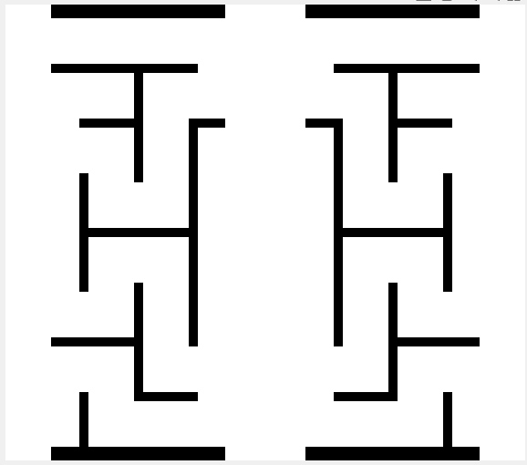
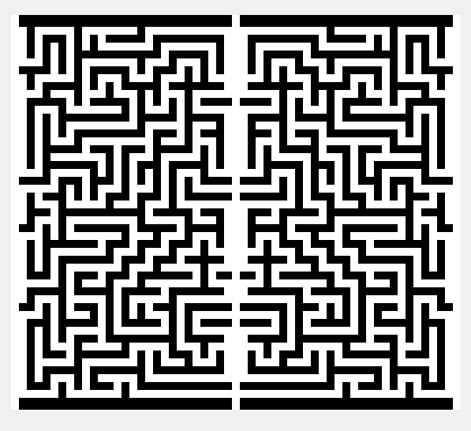
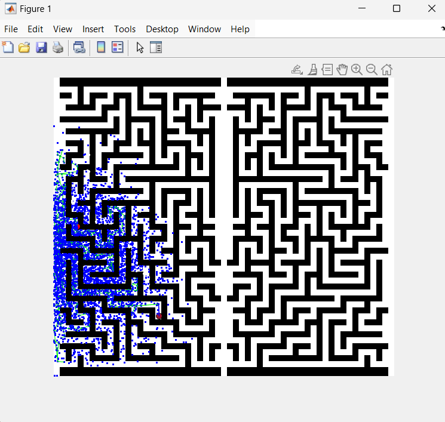
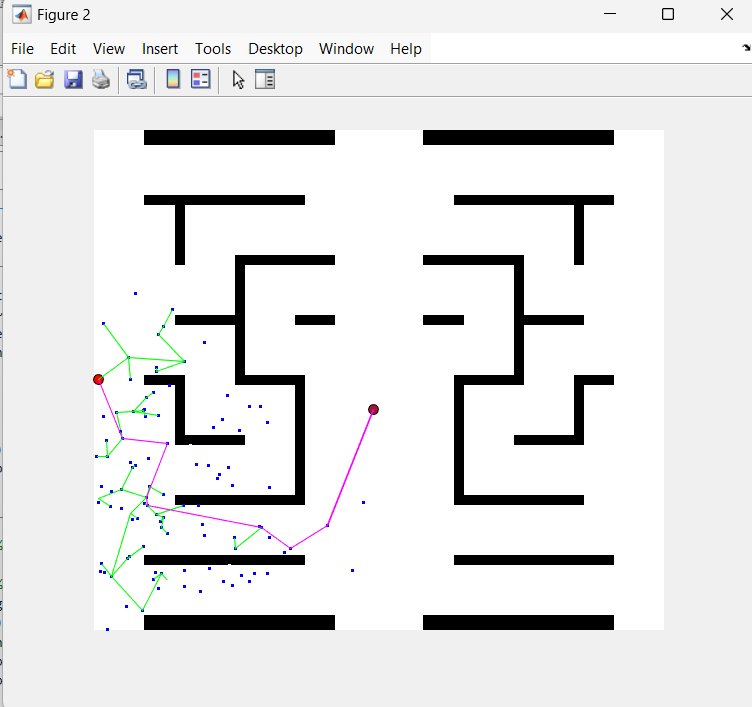
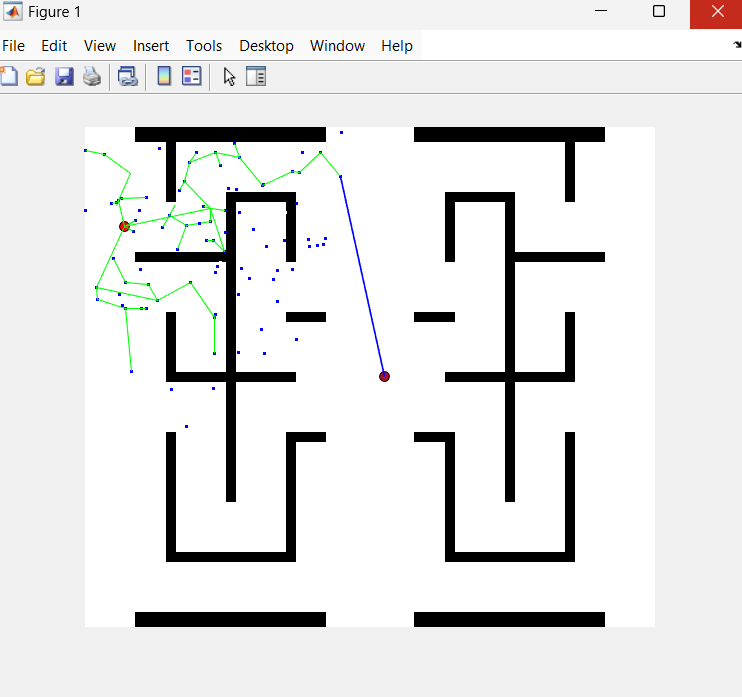
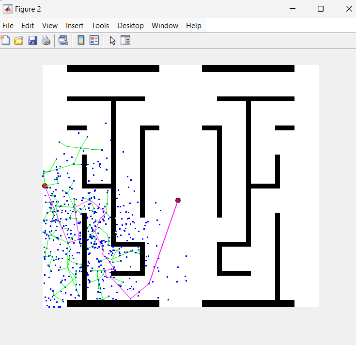
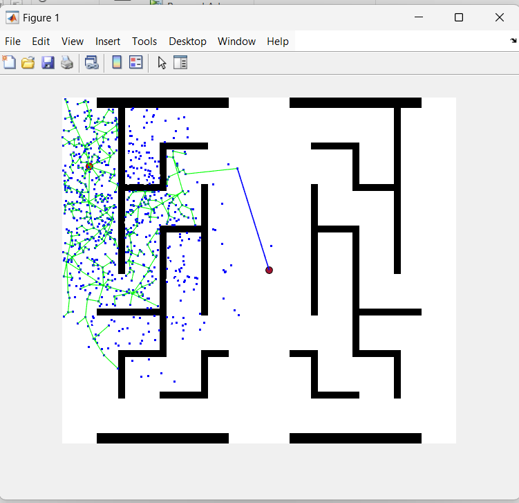
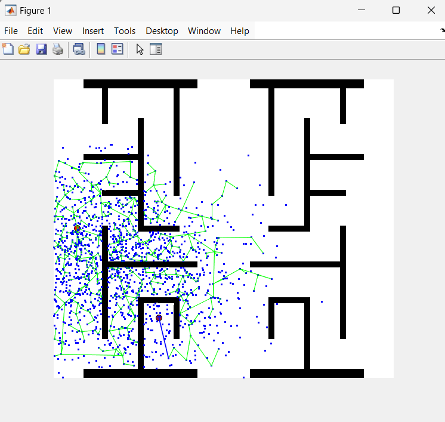

# bug arena
 A arena in maltab for path planning algorithm comptition 

<br>


## RRT Algorithm for solving maze

There are two types of map that can be used:
+ **Easy map**: [script](generateEasyMap.m)
+ **more complicated map**: [script](generateMap.m)

<div style="display:flex">
    <div style="flex:1;padding-right:10px;">
        
    </div>
    <div style="flex:1;padding-left:10px;">
        
    </div>
</div>
<br>

In this Algorithm, start and target points are defined in the script. Searching for the path, starts from start point. and by generating random points around the start point, empty space will be found.
> The algorithm used for generating random points is **not** efficient, therefore, complex maps cannot be solved completely.

<br>

## How to use the code
[maze_solver](maze_solver.m) script in MATLAB, finds a path through the maps. 

> Keep that in mind that ***complicated maps*** require more time to get solved and with current algorithm, mostly fails to find a path to the middle side of map.

***Dependency*** : Navigation Toolbox 

- **Choose the map**
    > Define the type of the map to be either easy or complex

    ```Matlab
        map = generateEasyMap();
    ``` 
    or 
    ```Matlab
        map = generateMap();
    ``` 

- **Define the Start and Target points**
    > Start and target points are defined by 3 values in the code, ***x*** and ***y*** coordinates plus the ***point ID***.
    > + **Point ID** : is **1** for start point and will be used later for defining other points *parent ID* 

    ```Matlab
    start = [5, 250, 1];
    target = [280,280];
    ```
    > *NOTE* : Target point desn't require an ID, as it wont be a parent to any other point. 

<br>

## Results
Dark red points are the targets and red points, start points.
+ **Complex map**

    

+ **Easy maps**
    > Pink Path is the final path to the target.\
    *It is not drawn in all figures.*

    
    
    
    
    